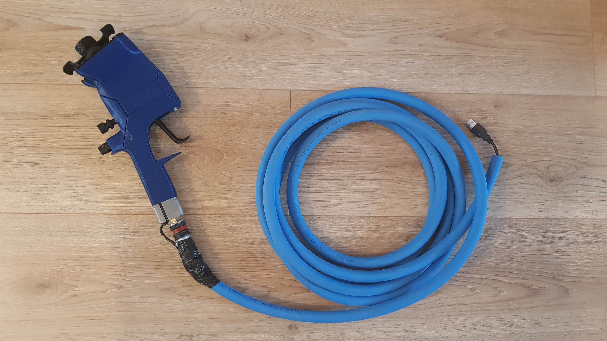
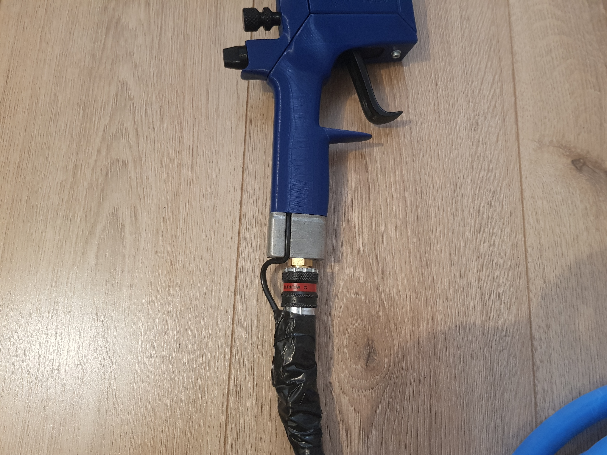
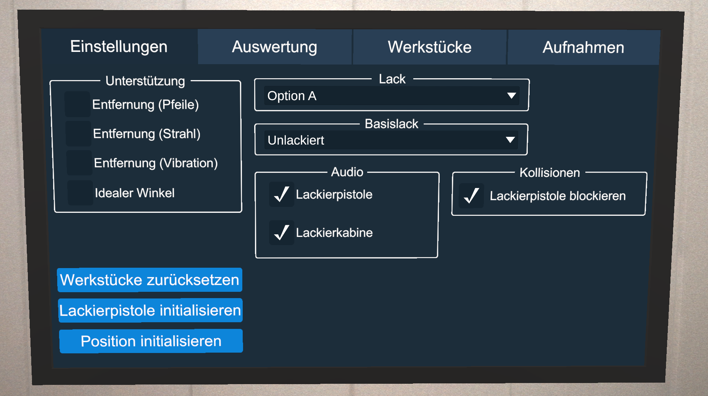

In diesem Repository sind die 3D-Modelle sowie Anleitungen enthalten, die den Druck und den Zusammenbau einer Nachbildung einer echten Lackierpistole ermöglichen.

# Voraussetzungen
- 3D-Drucker
- Lötkolben
- Verschiedenfarbige dünne Kabel
- Schrumpfschläuche/Isolierband

Weitere benötigte Materialien sind im Dokument [BenötigteMaterialien.pdf](Anleitung/BenötigteMaterialien.pdf) aufgelistet.

# Dateistruktur

**Anleitung**: Anleitung für den Zusammenbau der Lackierpistole. Dabei wird auch beschrieben, wie die Elektronik verlötet werden muss und wie die Software auf dem Arduino Nano installiert wird.

**Druckdateien**: Die 3D-Modelle der Einzelteile der Lackierpistole, die für den Nachbau gedruckt werden müssen.

**Sketch**: Die Software, die auf dem Arduino Nano installiert werden muss.

# Druckschlauch

Für eine besserer Haptik sollte ein Druckschlauch an dem Nachbau befestigt werden. Hierfür kann ein normaler Druckschlauch verwendet werden. Auf den Bildern ist ein 5 Meter langer PVC-Schlauch mit einem Innendurchmesser von 9 mm zu sehen. Soll das USB-Kabel durch den Schlauch geführt werden, sollte dieser mindestens einen Durchmesser von 9 mm haben. Zur Befestigung des Schlauches kann ein Kupplungsstecker mit Außengewinde (golden auf dem Bild) genutzt werden, der in die Druckschlauchhalterung (`Druckdateien\Druckschlauchmount\Schraubmount.3mf`) gedreht wird. Auf dem Bild ist die Druckschlauchhalterung metallisch und sollte wenn möglich auch beim eigenen Druck aus Metall bestehen.

Um das USB-Kabel durch den Schlauch zu führen, wurde dieser am Ende, das zur Lackierpistole führt, aufgeschnitten. Das Ventil am anderen Ende wurde abgeschnitten, um von hier das Kabel durch den Schlauch zu führen. In die Lackierpistole muss der USB-Mini-Stecker, weshalb dieser voran durch den Schlauch geschoben wird. In der Regel muss etwas von dem Gummi des Steckers entfernt werden, damit der Stecker durch den Schlauch passt. Der Stecker wird dann durch die aufgeschnittene Stelle am anderen Ende geführt und in die Lackierpistole gesteckt. Das schwarze Klebeband dient zur Stabilisierung.

# Treiber

Möglicherweise ist ein Treiber nötig, damit der Arduino Nano vom PC erkannt wird. Dieser kann [hier](http://www.wch-ic.com/downloads/CH341SER_ZIP.html) heruntergeladen werden.

# Lackierpistole initialisieren

Um die Lackierpistole in der VR-Lackierwerkstatt nutzen zu können, müssen die Position der Lackierpistole, der Abzugshebel und die Drehknöpfe initialisiert werden. Dies muss in der Regel nur einmal gemacht werden oder wenn sich die Position des Controllers an der Lackierpistole verändert. Der Initialisierungsprozess wird im Probiermodus der VR-Lackierwerkstatt durchgeführt. Dieser kann gestartet werden, wenn im Anmeldebildschirm *Ohne Anmeldung* oder im Hauptmenü *Probiermodus* ausgewählt wird.

.

## Abzugshebel und Drehknöpfe initialisieren

Die Initialisierung des Abzugshebels und der Drehknöpfe kann gestartet werden, indem *Lackierpistole initialisieren* auf dem Monitor ausgewählt  oder die Taste "I" auf der Tastatur gedrückt wird. Auf dem Monitor erscheinen dann Anweisungen, die durchgeführt werden müssen.

## Position
Die Initialisierung der Position der Lackierpistole kann gestartet werden, indem *Position initialisieren* auf dem Monitor ausgewählt oder die Taste "O" auf der Tastatur gedrückt wird. Vor dem Monitor erscheint dann eine durchsichtige Lackierpistole und die virtuelle Lackierpistole in der Hand verschwindet. Nun muss die echte Lackierpistole möglichst genau so vor dem Monitor positioniert werden, dass diese mit der durchsichtigen Lackierpistole übereinstimmt. Der Prozess wird beendet, wenn der Abzughebel gedrückt wird.